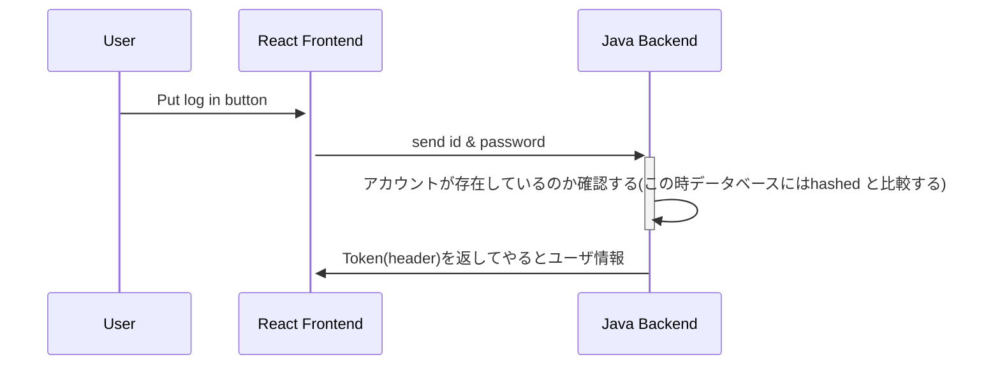

```mermaid
sequenceDiagram
    participant User as User
    participant Frontend as React Frontend
    participant Backend as Java Backend

    User->>+Frontend: Put log in button
    Frontend->>+Backend: send id & password
    Backend->>-Backend: アカウントが存在しているのか確認する(この時データベースにはhashed と比較する)
    Backend->>+Frontend: Token(header)を返してやるとユーザ情報
```
