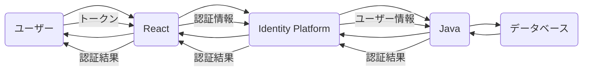

```mermaid
graph LR

A(ユーザー) --> B(React)
B(React) --> C(Identity Platform)
C(Identity Platform) --> D(Java)
D(Java) --> E(データベース)
E(データベース) --> D(Java)
D(Java) --> C(Identity Platform)
C(Identity Platform) --> B(React)
B(React) --> A(ユーザー)

A(ユーザー) -- トークン --> B(React)
B(React) -- 認証情報 --> C(Identity Platform)
C(Identity Platform) -- ユーザー情報 --> D(Java)
D(Java) -- 認証結果 --> C(Identity Platform)
C(Identity Platform) -- 認証結果 --> B(React)
B(React) -- 認証結果 --> A(ユーザー)

```
