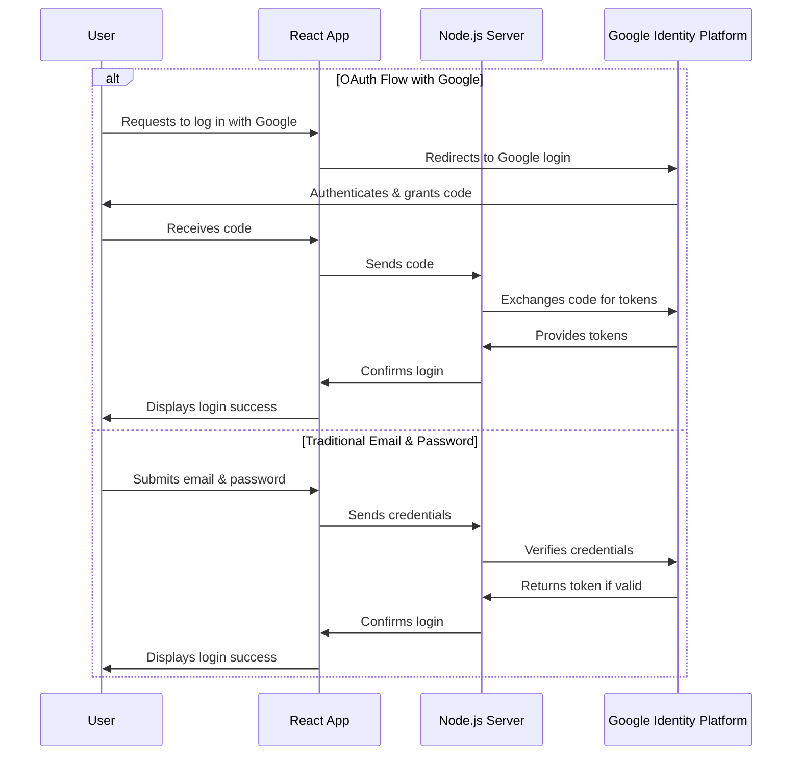

```mermaid
sequenceDiagram
    participant User as User
    participant ReactApp as React App
    participant NodeServer as Node.js Server
    participant GoogleIdentity as Google Identity Platform

    alt OAuth Flow with Google
        User->>ReactApp: Requests to log in with Google
        ReactApp->>GoogleIdentity: Redirects to Google login
        GoogleIdentity->>User: Authenticates & grants code
        User->>ReactApp: Receives code
        ReactApp->>NodeServer: Sends code
        NodeServer->>GoogleIdentity: Exchanges code for tokens
        GoogleIdentity->>NodeServer: Provides tokens
        NodeServer->>ReactApp: Confirms login
        ReactApp->>User: Displays login success
    else Traditional Email & Password
        User->>ReactApp: Submits email & password
        ReactApp->>NodeServer: Sends credentials
        NodeServer->>GoogleIdentity: Verifies credentials
        GoogleIdentity->>NodeServer: Returns token if valid
        NodeServer->>ReactApp: Confirms login
        ReactApp->>User: Displays login success
    end

```
